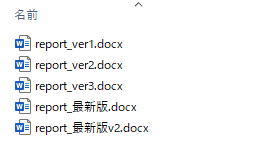

# 第1章: 基本操作

## はじめに
この資料は、木下研で研究をはじめるにあたって必要となる，信号処理や機械学習（ディープラーニングを含む）の仕組みやプログラムを理解するために書かれたものです．

基礎となる数学の知識から、Python というプログラミング言語を用いたコーディングの基本、機械学習・ディープラーニングの基礎的な理論、音や画像の信号処理の理論とコーディングに至るまで、幅広いトピックを解説しています。

研究には、ある程度、線形代数や確率統計といった数学の知識から、何らかのプログラミング言語が使えることなどが必要となってきます。
しかし、そういった数学やプログラミングの全てに精通していなければ研究をはじめられないかというと、必ずしもそうではありません。

本資料では、まず必要になる最低限の数学とプログラミングの知識から学び始められるように、資料を充実させています。
また，本資料に沿って作成する提出物はGitHub上のrepoで管理します．

GitHubは，現在のソフトウェア開発にはなくてはならないサービスです．
まずは，GitHubのことから勉強をはじめましょう．

## GitHub
GitHub は，`Git`を使った`バージョン管理`システムをインターネット上で提供するサービスです．
さて，`Git`や`バージョン管理`という聞き慣れない用語が出てきました．

以下の図を見てください．



レポートを作成する際，図のような状況になったことはありませんか？
なにか大きな修正が必要となったときに，昔の状態に戻せなくなってしまうことが不安でファイルをコピーしておき，
どれが新しいバージョンなのかわかるように名前をつけておく．
ただ，修正したものよりも，修正前のほうがやっぱり良いと思って古いバージョンのファイルに修正を加えてそれを最新版とする…．
こういったことを繰り返すと，どれが最新のファイルなのかわからなくなってしまいます．

プログラミングでも同様の事が起こります．
つまり，プログラムを修正する際にバックアップのためプログラムをコピーすることを繰り返すと，
最新のプログラムがどれかわからなくなってしまいます．
1人の状況ならまだ良いですが，複数人で開発を行うとなると状況はさらに複雑になってしまいます．

バージョン管理システムは，このような混乱を避け，ファイルのバージョンをきれいに管理するためのシステムです．
具体的には，以下のような機能を持ちます．
- ファイルの変更や更新を自動で管理してくれる
- だれが，いつ，どこを変更したかを記録してくれる
- 過去の状態にすぐに戻すことができる

こうした機能を提供するシステムの1つがGitで，GitHubはgitを使って動いているサービスです．
GitHubを使ってファイルを管理するとそれらファイルがインターネット上のサーバにもコピーされるため，
卒業論文の締め切り前にPCが壊れてファイルがなくなってしまっても，すぐにダウンロードできます．

## Git の用語
Git には専門的な用語が複数使われます．
これら用語を初心者に馴染みのある言葉で説明します．
わかりやすさ重視のために正確性を多少犠牲にしています．

### リポジトリ (repository)
リポジトリとは，バージョン管理を行っているフォルダのことを言います．
そのフォルダ (リポジトリ) の中に作られるすべてのフォルダやファイルがバージョン管理の対象となります．
リポジトリには，以下の2種類があります．
- ローカルリポジトリ

    手元のPCに保存されているリポジトリです

- リモートリポジトリ

    GitHubのサーバ上に保存されているリポジトリです

### クローン (clone)
クローンは，一言でいうと**ダウンロード**です．
リモートリポジトリ (GitHubのサーバ上にあるリポジトリ) を
ローカルリポジトリ (手元のPC) にダウンロードすることを指します．

### プル (pull)
プルも，一言でいうと**ダウンロード**です．
クローンと何が違うのかと思ったのではないでしょうか．
クローンは，リモートリポジトリのデータをすべてダウンロードするのに対し，
プルは，**ローカルリポジトリにないデータだけをダウンロード**します．

### アッド (add)
ローカルリポジトリのファイルを変更したとします．
このとき，Gitは，「今回，リポジトリ内のどのファイルがどれだけ変更されたか」を記録します．
この変更されたファイルのリストを作成するための作業をアッドと言います．

### コミット (commit)
コミットは，今回の変更をGitに保存することです．
アッドしたファイルを実際にリポジトリの変更履歴として保存します．
ライザップとは関係ありません．

コミットを行うと**その時点でのリポジトリの状態が保存**されます．
これにより，もし間違った修正などをしてしまったときには，過去にコミットした時点の状態にいつでも戻すことができます．

### プッシュ (push)
一言でいうと**アップロード**です．
コミットして変更が保存されたローカルリポジトリをリモートリポジトリにアップロードすることです．

### ブランチ (branch)
リポジトリの内容をコピーしたものを作成することです．
作成されたコピーのこともブランチと呼びます．
初期状態では，リポジトリには main ブランチと呼ばれるブランチが1つのみあります．
mainブランチから作成された新しいブランチのファイルは，元々のファイルと独立に変更することができます．

### マージ (merge)
ブランチ同士を結合して一つのブランチにまとめることです．
個々のブランチで変更された箇所を集約します．
複数人で作業を行う際などには，一人ひとりが自分用のブランチを作成し，
作業が完了したところでブランチをmainブランチにマージするといった手順が取られます．
ちょっと面倒ですが，こういった手順を踏むことで，現在のファイルに誤った修正を加えてしまうリスクを抑え
安全にファイルを更新していくことができます．


## GitHub の用語
Git をベースとして動いているGitHubですが，GitHubならではの機能もあります．

### フォーク (fork)
フォークは、他の誰かがGitHub上で作成したリモートリポジトリを、自分自身のリモートリポジトリとしてコピーするための機能です。
他の人のリポジトリで公開されているプログラムに，自分にとってより使いやすくなるよう修正したいとします．
しかし，他の人のリポジトリを勝手に編集することは，普通できません．
ここでフォークを利用すると、そのリポジトリの全てのコードを自分自身のリポジトリとしてコピーすることができます。
そして，コピーしたリポジトリに対しては，自由に変更を加えることが可能になります。

このゼミでは，B3の通常提出でforkは使いません．
forkは「他人の公開repoを自分側にコピーして改善したいときに使う機能」と理解すれば十分です．

### プルリクエスト (pull request)
フォークしたリポジトリへの変更が他の人にとっても有用だと思う場合，
元々 (フォーク元)のリポジトリに同じ変更を反映させたいと思うかもしれません．
そのような場合に利用できる機能がプルリクエストです．

これは，フォークしたリポジトリから元々のリポジトリへ変更を反映させるリクエストを送る機能で、
元々のリポジトリの管理者がその変更を承認することで変更が反映されます．

このゼミでは，pull request はGit/GitHubの学習項目として1回体験しますが，
B3の毎週の通常提出では必須にしません．


以上がGitおよびGitHubの大まかな説明ですが，やはり言葉だけでの説明では理解しにくいと思います．
実際にこれらの操作を行って，理解を深めましょう．

## 実践 GitHub
このゼミでは，GitHub上のrepoを役割ごとに分けて使います．
- 共通 repo: 教材配布，見本コード，共通資産の参照先
- submission repo: 各学生が通常提出を残すための private repo

B3の通常提出では，forkは使いません．
学期の最初に共通 repo と自分の submission repo をそれぞれ clone し，
毎週の提出では自分の submission repo で `edit -> commit -> push` を繰り返します．
pull request は練習として体験しますが，通常提出のたびに作る必要はありません．

これらの操作の多くは，**コマンド**で行うことができます．
以下の手順に従って操作をしてみましょう．

1. ターミナル (Windowsの場合はWSL2) を起動する
1. `cd`コマンドを使い，作業ディレクトリをホームディレクトリに変更する
   ```
   $ cd ~/
   ```

2. 共通 repo と自分の submission repo をホームディレクトリに clone する
   ```
   $ git clone <common-repo-url>
   $ git clone <submission-repo-url>
   $ cd <submission-repo-name>
   ```
   共通 repo は教材を見るためのもの，submission repo は提出物を置くためのものです．
1. 初めて git を使う人は，以下のコマンドを実行します
   ```
   $ git config --global user.name "<ユーザ名>"
   $ git config --global user.email "<メールアドレス>"
   ```

3. まずは通常提出の流れとして，submission repo の default branch で作業する
4. 自分用の提出ディレクトリを作る．下記のコマンドを実行して，新しいディレクトリを作成し，ターミナルの作業ディレクトリを作成したディレクトリに移動できます．

   今後，課題で作成するプログラムなどはすべて submission repo 内の提出ディレクトリに追加していきます．
   ```
   $ mkdir -p session-17
   $ cd session-17
   ```
5. 作成したディレクトリに，`q01.txt`というファイルを作成してみましょう．

   Vimというソフトウェアを使うと，ターミナル上でテキストファイルを作成したり編集したりできます．
   以下のコマンドを入力してください．
   ```
   $ vim q01.txt
   ```
   q01.txtというファイルが作成され，中身を変更できます．
   ただし，vimを使って文字を入力するには，まず`i`キーを押して入力モードに移行する必要があります．
   入力モードを終わり，元々のノーマルモードに戻るには`Esc`キーを押します．
   ノーマルモードの状態で，`:wq`と入力しエンターキーを押すと，ファイルが保存されVimが終了します．  

   VSCodeを使ってディレクトリやファイルを操作することもできます．
   以下のコマンドを実行すると submission repo のディレクトリをVSCodeで開くことができます．
   ```
   $ code ~/<submission-repo-name>
   ```
   今後，課題の回答として作成するファイル名やディレクトリ名は，各回の handout の指示に従ってください．
   たとえば `session-17/q01.txt` や `session-18/answer.py` のように，回ごとの提出物をまとめておくと管理しやすくなります．

6. 新しく書いたコードを git の管理対象に追加（アッド）する
   ```
   $ git add q01.txt
   ```
7. コミットし，変更を記録する

   コミットメッセージは「XX章q00を追加」などわかりやすい文章にしてください．
   ```
   $ git commit -m "session-17"
   ```
8. submission repo の default branch に push する
   ```
   $ git push origin main
   ```

   これがB3の通常提出の基本形です．

### pull request の練習
pull request は，通常提出のたびには使いませんが，
GitHub の機能を知るために 1 回は練習しておくと役に立ちます．

```
$ git checkout -b pr-practice
$ git add <changed-files>
$ git commit -m "pr practice"
$ git push -u origin pr-practice
```

このあと GitHub 上で `pr-practice` ブランチから pull request を作成し，
「変更点」「確認方法」「未確認事項」を短く書いてみてください．

以上が，このゼミでの GitHub 利用の流れです．
次章以降の課題に取り組む際にも，通常提出は submission repo で行い，
教材の確認は共通 repo と各回の handout を参照してください．
