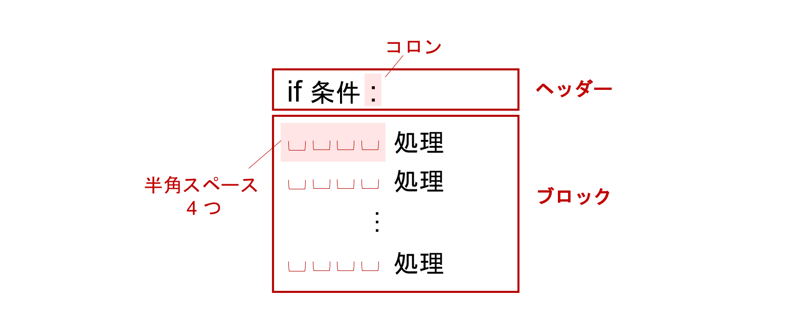
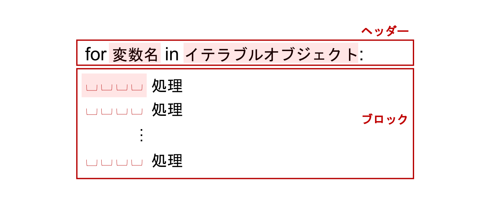
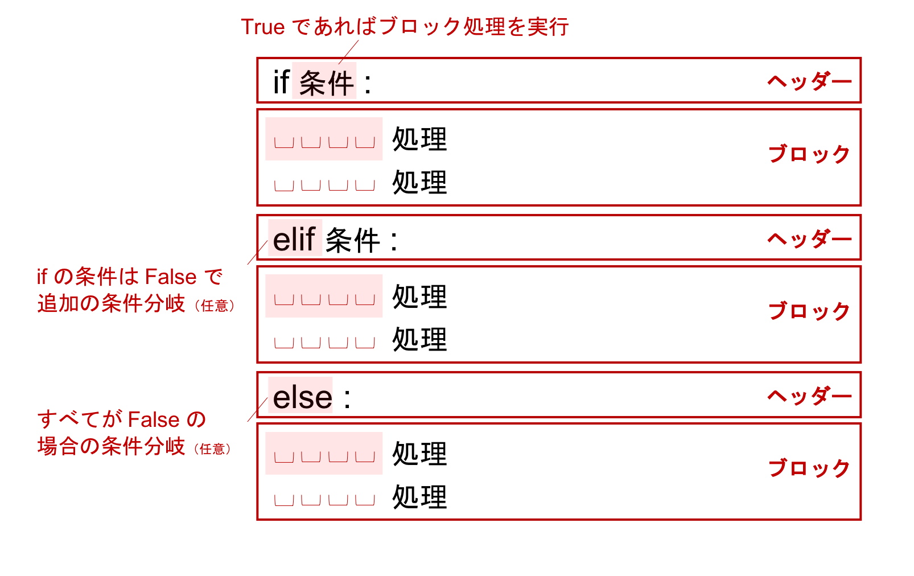
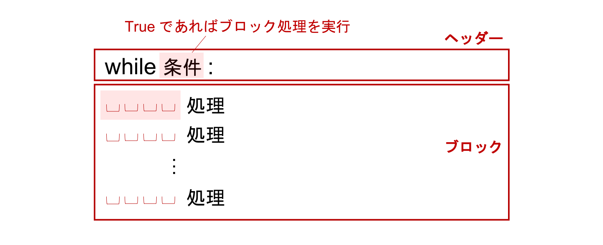
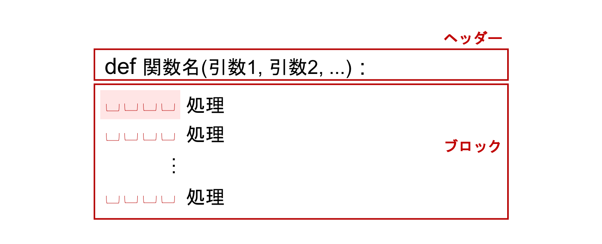
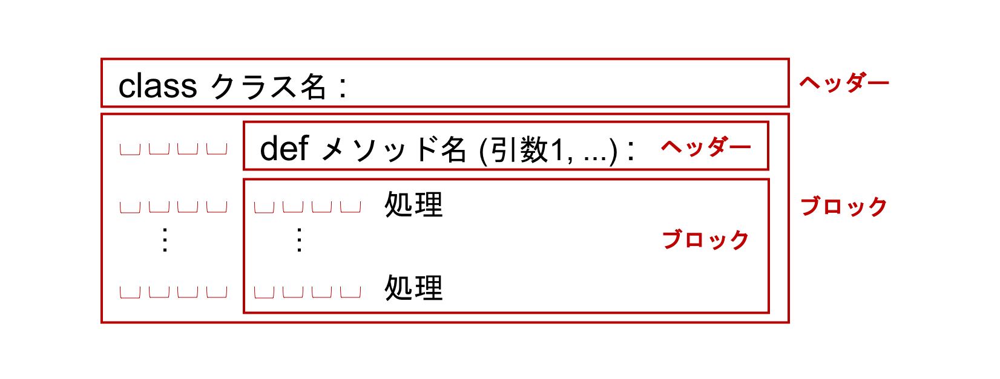

# Python 入門

本章では、プログラミング言語 Python の基礎的な文法を学んでいきます。
次章以降に登場するコードを理解するにあたって必要となる最低限の知識について、最短で習得するのが目標です。
より正確かつ詳細な知識を確認したい場合には、[公式のチュートリアル](https://docs.python.jp/3/tutorial/index.html)などを参照してください。

Pythonにはバージョンとして 2 系と 3 系の 2 つの系統があり、互換性のない部分もあります。
本研修では、3 系である **Python 3.12** 系を標準とします。
上流の最新 stable は 2026年4月時点で Python 3.14.4 ですが、この repo は共有環境との整合のため 3.12 系で揃えます。

## Python の特徴

プログラミング言語には、Python 以外にも C 言語や Java、Ruby、R のように様々なものがあります。それぞれの言語がすべての用途に適しているわけではなく、しばしば用途によって得手不得手があります。

木下研では基本的に Python というプログラミング言語を扱います。
その理由は、Python はデータ解析・機械学習のためのライブラリが充実しており、データ解析や機械学習の分野で最もよく使われている言語だからです。
また、Web アプリケーションフレームワークの開発も活発で、データ解析だけでなく Web サービス開発まで同じ言語で統一して行える点も魅力です。

さらには、初学者にとっても学びやすい言語です。
初学者がプログラミングを学び始めるときにつまづきがちな難しい概念が他の言語と比べ多くなく、入門しやすい言語といえます。

まとめると、Python には

- データ解析や機械学習によく使われている
- Web アプリケーションの開発などでもよく使われている
- 初学者がはじめやすい言語

のような魅力があります。

## Python の実行
みなさんは，[Google Colaboratory](https://colab.research.google.com/)を利用して Python を書いたことがあると思います．
Google Colab は，Pythonをさっと書いて実行結果を確認する目的では大変便利です．
一方，コードが長く複雑になってくると，Google Colab 上でプログラミングするのは難しくなってきます．
そこで，本研修では，みなさんのPC上で Python を実行するやり方に慣れてもらおうと思います．

まず，以下のコマンドを入力し，Python を実行するための仮想環境を構築します．
```
$ mkdir -p ~/workspace/python-basics
$ cd ~/workspace/python-basics
$ python3 -m venv .venv
```
Python の実行環境とは，Python のプログラムを実行するために必要となるソフトウェアの組み合わせを指します．
また，仮想環境とは，簡単に言ってしまえば本研修のための専用環境のことです．
普通 Python の実行環境は一台のPCにつき1つのみですが，
仮想環境は一台のPC上にいくつも作ることができます．

仮想環境を有効にするには以下のコマンドを入力します．
```
$ source .venv/bin/activate
```
仮想環境が有効になった状態で`python`と入力すると，
Python プログラムを1行ごとに入力・実行できる対話型のインタープリタが起動します．
インタープリタを終了するには以下のように入力します．
```
>>> exit()
```
また，仮想環境を無効にするには以下のコマンドを入力します．
```
$ deactivate
```

### 文法とアルゴリズム

プログラミングによってある特定の処理をコンピュータで自動化したい場合、**文法**と**アルゴリズム**の 2 つを理解しておく必要があります。

プログラムでは、まずはじめにコンピュータに命令を伝えるためのルールとなる**文法**を覚える必要があります。
文法を無視した記述があるプログラムは、実行した際にエラーとなり処理が停止します。そのため、文法はしっかりと理解しておく必要があります。

ただし、文法さえ理解していれば十分かというとそうではありません。一般的に、初学者向けのプログラミングの参考書では、この文法だけを取り扱うことも多いのですが、コンピュータに処理を自動化させることが目的であれば、文法だけでなく**アルゴリズム**も理解する必要があります。アルゴリズムとは、どういう順番でどのような処理をしていくかの一連の手順をまとめたものです。

この章では、Python の文法について紹介し、機械学習やディープラーニングで必要となるアルゴリズムについてはこれ以降の章で紹介します。

ここでは以下 4 つの文法に主眼を置きながら説明していきます。

- 変数
- 制御構文
- 関数
- クラス

## 変数

**変数 (variable)** とは、様々な値を格納することができる、**名前がついた入れ物**です。
この変数に値を格納したり、更新したりすることで、計算結果を一時的に保持しておくことができます。

### 代入と値の確認

それでは、以下のセルのように，`a` という名前の変数に`1` を**代入**してみましょう。

```python
a = 1
```

代入は `=` の記号を用います。
数学的には `=` は等しいという意味を持ちますが、Python では**「左辺の変数に、右辺の値を代入する」**という意味になります。
また，これ以降，Python のプログラムは上のようにコードセルを用いて記述します．

対話型インタープリタ上では、変数名だけを記述した行を入力すると、値を確認することができます。

```python
a
```

```text
1
```

このように、変数に格納されている値を確認することができました。
また、値を確認するための他の方法として、`print()` と呼ばれる**関数 (function)** を使用することもできます。
関数について詳しくは後述しますが、`print()` のように Python には予め多くの関数が定義されています。 そのような関数を**組み込み関数 (built-in function)** といいます。

```python
print(a)
```

```text
1
```

変数名だけをセルに記入して実行する場合と`print()`を利用する場合の違いについては、後述します。

変数につける名前は、コードを書く人が自由に決めることができます。
ただし、わかりやすい名前をつけることがとても大切です。
例えば、人の名前を格納するための変数が `a` という変数名だと、それがどのような使われ方をするのかを容易に類推することができません。
`name` という名前であれば、ひと目で見て何のための変数かが分かるようになります。
これは、自分のコードを読む他人や、未来の自分にとってコードを理解するための大きな手がかりとなります。

### コメント

Python では、`#` の後からその行の終わりまでに存在する全ての文字列は無視されます。
この `#` の後ろに続く部分を**コメント (comment)**と呼び、すでに書かれたコードをコメントにすることを**コメントアウト (comment out)**と言います。
コメントは、コード中に変数の意味や処理の意味をコードを読む人に伝えるためによく使われます。

Jupyter Notebook のコードセルに書かれたコードを行ごとコメントアウトしたい場合は、その行を選択した状態で `Ctrl + /` を入力することで自動的に行の先頭に `#` 記号を挿入することができます。複数行を選択していれば、選択された複数の行が同時にコメントアウトされます。また、コメントアウトされている行を選択した状態で同じキー入力を送ると、コメントアウトが解除されます。これを**アンコメント (uncomment)**と呼ぶこともあります。

下のセルを実行してみましょう。

```python
# この行及び下の行はコメントアウトされているため実行時に無視されます
# print(a)
```

`print(a)` が書かれているにも関わらず、何も表示されませんでした。
これは、`print(a)` 関数が書かれた行がコメントアウトされていたためです。

### 変数の型

プログラミングで扱う値には種類があります。
Python では、**整数 (integer)**、**実数 (real number)**、**文字列 (string)** などが代表的な値の種類です。
それぞれの種類によって、コンピュータ内での取扱い方が異なり、この種類のことは一般に**型 (type)** と呼びます。

例えば、整数、実数、そして文字列をそれぞれ別々の変数に代入するコードは以下のとおりです。

```python
a = 1
```

```python
b = 1.2
```

```python
c = 'Chainer'
```

コンピュータの中での取り扱い方は異なりますが、Python では**変数の型を自動的に決定する**ため、初めのうちはあまり気にする必要はありません。
ただし、違う型同士の演算では場合によってエラーが発生するなどの問題が生じるため、簡単に型の特徴は把握しておく必要があります。

まずは、上記の `a`, `b`, `c` の型を確認する方法を紹介します。
型の確認は `type()` という組み込み関数を使用します。

```python
type(a)
```

```text
int
```

```python
type(b)
```

```text
float
```

```python
type(c)
```

```text
str
```

`a` は `int` という整数の型をもつ変数であり、`b` は `float` という実数の型をもつ変数です。
この `float` という型の名前は、コンピュータ内で実数を扱うときの形式である**浮動小数点数 (floating-point number)** に由来しています。

`c` は `str` という文字列の型をもつ変数であり、値を定義するにはシングルクォーテーション `' '` もしくはダブルクォーテーション `" "` で対象の文字列をくくる必要があります。

Python では、`.` を含まない連続した数字を `int`、直前・直後も含め `.` が含まれる連続した数字を `float` だと自動的に解釈します。
例えば、`7` や `365` は `int` ですが、`2.718`、`.25`、`10.` などは `float` になります。

実数の `0` は `0.0` とも `.0` とも `0.` とも書くことができます。

```python
type(0)
```

```text
int
```

```python
type(0.)
```

```text
float
```

```python
type(.0)
```

```text
float
```

例えば、実数の `5` は以下のように書くことができます。

```python
type(5.0)
```

```text
float
```

```python
type(5.)
```

```text
float
```

一方、`.5` と書くと、これは `0.5` の略記と解釈されることに注意してください。

```python
type(.5)
```

```text
float
```

```python
print(.5)
```

```text
0.5
```

### 複数同時の代入

Python では複数の変数に対する代入を一度に行うことができ、**複数同時の代入 (multiple assignment)** と呼びます。
例えば、上記の `a = 1` と `b = 1.2` を同時に一行で記述すると以下のようになります。

```python
a, b = 1, 1.2
```

3 つ以上の変数に対して、複数同時の代入を行うことも可能です。

```python
a, b, c = 1, 1.2, 'Chainer'
```

複数同時の代入は後の章で頻出するため、覚えておきましょう。

### 算術演算子

様々な計算を意味する**演算子**と呼ばれる記号があります。
はじめに紹介するのは**算術演算子 (arithmetic operator)** と呼ばれるもので、 2 つの変数または値を取り、 1 つの演算結果を返します。

代表的な演算として**四則演算（加算・減算・乗算・除算）**があります。
四則演算に対応する演算子として、Python では以下の記号が用いられます。

| 演算 | 記号 |
|------|------|
| 加算（足し算） | `+` |
| 減算（引き算） | `-` |
| 乗算（掛け算） | `*` |
| 除算（割り算） | `/` |

具体例を見ながら使い方を説明します。

```python
# 整数と整数で加算 -> 結果は整数
1+1
```

```text
2
```

このように、演算子を使う際には、**記号の両側に値を書きます。**
このとき、演算子の両側にひとつずつ空白を空けることが多いです。
文法的な意味はありませんが、コードが読みやすくなります。
この空白は Python のコーディング規約である [PEP8](https://www.python.org/dev/peps/pep-0008/#should-a-line-break-before-or-after-a-binary-operator) でも推奨されています。

```python
1 + 1
```

```text
2
```

値が代入されている変数との演算も下記のように行うことができます。

```python
a + 2
```

```text
3
```

また、`int` と `float` は異なる型同士ですが、計算を行うことができます。
`int` と `float` の演算結果の型は `float` になります。

```python
# 整数と実数で加算 -> 結果は実数
a + b
```

```text
2.2
```

他の演算子の例を示します。

```python
# 整数と整数で減算 -> 結果は整数
2 - 1
```

```text
1
```

```python
# 実数と整数で減算 -> 結果は実数
3.5 - 2
```

```text
1.5
```

```python
# 整数と整数で乗算 -> 結果は整数
3 * 5
```

```text
15
```

```python
# 実数と整数で乗算 -> 結果は実数
2.5 * 2
```

```text
5.0
```

```python
# 整数と整数で除算 -> 結果は実数
3 / 2
```

```text
1.5
```

```python
# 整数と整数で除算 -> 結果は実数
4 / 2
```

```text
2.0
```

Python 3 では、 `/` 記号を用いて除算を行う場合、除数（割る数）と被除数（割られる数）が整数であっても、計算結果として実数が返ります。
計算結果として実数を返す除算のことを特に、**真の除算 (true division)** と言います。
一方、商（整数部分）を返すような除算演算子として、 `//` 記号が用意されています。 `/` 記号を 2 回、間を空けずに繰り返します。計算結果として商を返す除算のことを、 **切り捨て除算 (floor division)** と呼びます。
商を計算したい場合に便利な演算子であるため、こちらも覚えておきましょう。

※ Python 2 では、除数も被除数も整数であった場合、 `/` 記号を用いても切り捨て除算が行われるので注意してください。

```python
# 整数と整数で切り捨て除算 -> 結果は整数
3 // 2
```

```text
1
```

```python
# 整数と整数で切り捨て除算 -> 結果は整数
4 // 2
```

```text
2
```

また、ここで注意すべき点として、整数や実数と文字列の演算は基本的にエラーになります。

```python
# error
a + c
```

```text
---------------------------------------------------------------------------
TypeError                                 Traceback (most recent call last)
<ipython-input-32-e81e582b6fa9> in <module>()
----> 1 a + c

TypeError: unsupported operand type(s) for +: 'int' and 'str'
```

**エラーメッセージを読みましょう。**

> TypeError: unsupported operand type(s) for +: 'int' and 'str'

と言われています。「+ にとって int と str はサポートされていない被作用子（+ が作用する対象のこと。operand）です」と書かれています。「int に str を足す」ということはできないというわけです。

`int` もしくは `float` と、 `str` の間の加算、減算、除算では上記のエラーが生じます。
ただし、`str` と `int` の**乗算**は特別にサポートされており、計算を実行することができます。

```python
# str と int で乗算
c * 3
```

```text
'ChainerChainerChainer'
```

上のコードは、`c` という文字列を `3` 回繰り返す、という意味になります。

`str` 同士は足し算を行うことができます。

```python
name1 = 'Chainer'
name2 = 'チュートリアル'

name1 + name2
```

```text
'Chainerチュートリアル'
```

整数と文字列を連結したいこともあります。
例えば、`1` という整数に、 `'番目'` という文字列を足して `'1番目'` という文字列を作りたいような場合です。
その場合には、型を変換する**キャスト (cast)** という操作をする必要があります。

何かを `int` にキャストしたい場合は `int()` という組み込み関数を使い、`str` にキャストしたい場合は `str()` という組み込み関数を使います。では、`1` という整数を `str` にキャストして、 `'番目'` という文字列と足し算を行ってみましょう。

```python
1
```

```text
1
```

```python
type(1)
```

```text
int
```

```python
str(1)
```

```text
'1'
```

```python
type(str(1))
```

```text
str
```

```python
str(1) + '番目'
```

```text
'1番目'
```

また、`+=` や `-=` もよく使います。
これは、演算と代入を合わせて行うもので、**累積代入文 (augmented assignment statement)** と呼ばれます。

下記に示すとおり、`+=` では左辺の変数に対して右辺の値を足した結果で、左辺の変数を更新します。

```python
# 累積代入文を使わない場合
count = 0
count = count + 1
count
```

```text
1
```

```python
# 累積代入文を使う場合
count = 0
count += 1
count
```

```text
1
```

四則演算の全てで累積代入文を利用することができます。
つまり、`+=`, `-=`, `*=`, `/=` がそれぞれ利用可能です。

Python には、他にも幾つかの算術演算子が用意されています。
例えば以下の演算子です。

| 演算 | 記号 |
|------|------|
| 累乗 | `**` |
|  剰余　 | `%` |

`**` を使うと、$2^3$ は以下のように記述することができます。

```python
# 累乗
2 ** 3
```

```text
8
```

`%` を使って、`9` を `2` で割った余りを計算してみましょう。

```python
# 剰余
9 % 2
```

```text
1
```

### 比較演算子

比較演算子は、2 つの値の比較を行うための演算子です。

| 演算 | 記号 |
|------|------|
| 小なり | `<` |
| 大なり | `>` |
| 以下 | `<=` |
| 以上 | `>=` |
| 等しい | `==` |
| 等しくない | `!=` |

比較演算子は、その両側に与えられた値が決められた条件を満たしているかどうか計算し、満たしている場合は `True` を、満たしていない場合は `False` を返します。
`True` や `False` は、**ブール (bool) 型**と呼ばれる型を持った値です。
ブール型の値は `True` もしくは `False` の 2 つしか存在しません。

いくつかの比較演算子の計算例を示します。

```python
1 < 2
```

```text
True
```

```python
# 型の確認
type(1 < 2)
```

```text
bool
```

```python
2 == 5
```

```text
False
```

```python
1 != 2
```

```text
True
```

```python
3 >= 3
```

```text
True
```

```python
'test' == 'test'
```

```text
True
```

等しいかどうかを判定する比較演算子 `==` を使う際は、代入演算子 `=` と間違えないように気をつけてください。

## エスケープシーケンス

通常の文字列では表せない特殊な文字を、規定された特別な文字の並びにより表したものを**エスケープシーケンス (escape sequence)** と呼びます。 

よく使用するものとして、**改行**を意味する `\n`（もしくは `¥n`）、**タブ**を意味する `\t`（もしくは `¥t`）があります。

```python
print('Hello\nWorld')
```

```text
Hello
World
```

```python
print('Hello\tWorld')
```

```text
Hello	World
```

最初に Jupyter Notebook 上で変数の値を確認する際に、`print()` を使う場合と使わない場合の違いについて触れましたが、エスケープシーケンスを評価したい場合には、`print()` を使う必要があります。

```python
d = 'Hello\nWorld'
```

```python
# エスケープシーケンスが評価されない
d
```

```text
'Hello\nWorld'
```

```python
# エスケープシーケンスが評価される
print(d)
```

```text
Hello
World
```

## 文字列メソッド

`str` 型の変数には、いくつか便利な機能がついています。
例えば、その変数が持つ全ての文字を小文字や大文字に変換する `lower()` や `upper()` といった機能があります。
このような型が持っている関数を**メソッド (method)** と呼びます。

```python
name = 'Chainer'

name
```

```text
'Chainer'
```

```python
# すべてを小文字に変換
name.lower()
```

```text
'chainer'
```

```python
# すべてを大文字に変換
name.upper()
```

```text
'CHAINER'
```

## f 文字列
文字列の特殊な (かつ便利な) 書き方として**f 文字列**があります．
これは、ある文字列の一部分に、あとから別な文字列を埋め込むために使用します。
f 文字列は，`f`というキーワードではじまり，その後に通常の文字列と同じく`''` (または `""`) で文字列を囲みます．
このとき，`{}`を文字列中に記述すると，そこに別の文字列を埋め込むことができます。

```python
name = 'Chainer'

f'{name} チュートリアルへようこそ'
```

```text
'Chainer チュートリアルへようこそ'
```

```python
name1 = 'Chainer'
name2 = 'チュートリアル'

f'{name1} {name2}へようこそ'
```

```text
'Chainer チュートリアルへようこそ'
```

f 文字列を用いると `int` 型 や `float` 型の変数を、`str` 型へ明示的にキャストすることなく文字列に埋め込むことができます。

```python
version = 3.7

f'Python {version}'
```

```text
'Python 3.7'
```

## 浮動小数点数がもつメソッド

「メソッド」は `str` 型の変数だけが持つものではありません。
`int` 型の変数や、`float` 型の変数にも、その型の特徴に合わせた機能が、メソッドとして提供されています。

例えば、`float` 型の変数には、`as_integer_ratio()` というメソッドがあり、比がその浮動小数点数の値となるような整数の組を返します。

例えば、0.5 という値は、分数で表すと $\frac{1}{2}$ です。
これは、以下のようにして調べることができます。

```python
0.5.as_integer_ratio()
```

```text
(1, 2)
```

0.25 であれば、$\frac{1}{4}$ となります。

```python
0.25.as_integer_ratio()
```

```text
(1, 4)
```

このような、型に紐付いたメソッドなどについては、この章の最後にある「クラス」という概念の説明の際にもう少し詳しく解説します。

## 複合データ型

これまでは `a = 1` のように 1 つの変数に 1 つの値を代入する場合を扱ってきましたが、複数の値をまとめて取り扱いたい場面もあります。
Python では複数の変数や値をまとめて扱うのに便利な、以下の 3 つの複合データ型があります。

- リスト (list)
- タプル (tuple)
- 辞書 (dictionary)

### リスト

複数の変数を `,` （カンマ）区切りで並べ、それらの全体を `[ ]` で囲んだものを **リスト (list)** と言います。
リストに含まれる値を**要素**と呼び、整数の**インデックス** （要素番号）を使ってアクセスします。

```python
# リスト型の変数を定義
numbers = [4, 5, 6, 7]

# 値の確認
print(numbers)
```

```text
[4, 5, 6, 7]
```

```python
# 型の確認
type(numbers)
```

```text
list
```

`numbers` には 4 つの数値が入っており、**要素数** は 4 です。
リストの要素数は、リストの**長さ (length)** とも呼ばれ、組み込み関数の `len()` を用いて取得することができます。
`len()` はよく使う関数であるため、覚えておきましょう。

```python
# 要素数の確認
len(numbers)
```

```text
4
```

リストの各要素へアクセスする方法はいくつかあります。
最も簡単な方法は `[]` を使ってアクセスしたい要素番号を指定して、リストから値を取り出したり、その位置の値を書き換えたりする方法です。
ここで、注意が必要な点として、Python では先頭の要素のインデックス番号が `0` である点があります。
インデックス番号 `1` は 2 番目の要素を指します。

```python
# 先頭の要素にアクセス
numbers[0]
```

```text
4
```

```python
# 先頭から3番目の要素にアクセス
numbers[2]
```

```text
6
```

```python
# 2 番目の要素を書き換え
numbers[1] = 10
```

```python
# 値の確認
numbers
```

```text
[4, 10, 6, 7]
```

また、インデックスに負の値を指定すると、末尾からの位置となります。
要素番号 `-1` で最後の要素を参照することができます。

```python
# 末尾の要素にアクセス
numbers[-1]
```

```text
7
```

```python
# 末尾から3番目の要素にアクセス
numbers[-3]
```

```text
10
```

次に、リストから一度に複数の要素を取り出す操作である**スライス (slice)** を紹介します。
`開始位置:終了位置` のようにコロン `:` を用いてインデックスを範囲指定し、複数の部分要素にアクセスします。
このスライスの処理は、この後の章でも多用するため、慣れておきましょう。

例えば、先頭から 2 つの要素を取り出したい場合、以下のように指定します。

```python
numbers[0:2]
```

```text
[4, 10]
```

`開始位置:終了位置` と指定することで、開始位置から**終了位置のひとつ手前**までの要素を抽出します。 
終了位置に指定したインデックスの値は含まれないことに注意してください。

また、指定する開始番号が `0` である場合、以下のような略記がよく用いられます。

```python
numbers[:2]
```

```text
[4, 10]
```

このように、先頭のインデックスは省略することができます。
このような記法を使う場合は、終了位置を示す数字を**取り出したい要素の個数**と捉えて、**先頭から 2 つを取り出す**操作だと考えると分かりやすくなります。

同様に、ある位置からリストの末尾までを取り出す場合も、終了位置のインデックスを省略することができます。
例えば、2 個目の要素から最後までを取り出すには以下のようにします。

```python
numbers[1:]
```

```text
[10, 6, 7]
```

この場合は、取り出される要素の個数は `len(numbers) - 1` 個となることに注意してください。

以上から、`numbers[:2]` と `numbers[2:]` は、ちょうど 2 個目の要素を境に `numbers` の要素を 2 分割した前半部分と後半部分になっています。
ここで、インデックスが 2 の要素自体は**後半部に含まれる**ということに注意してください。

また、開始位置も終了位置も省略した場合は、すべての要素が選択されます。

```python
numbers[:]
```

```text
[4, 10, 6, 7]
```

現状では、`numbers[:]` と `numbers` の結果が同じであるため、どのように使用するか疑問に思われるかも知れません。
しかし、後の章では NumPy というライブラリを用いてリストの中にリストが入ったような**多次元配列 (multidimensional array)** を扱っていきます。
そして多次元配列を用いて行列を表す場合には、`0 列目のすべての値`を抽出するために `[:, 0]` のような記法を用いるケースが登場します。
これは Python 標準の機能ではありませんが、Python 標準のスライス表記を拡張したものになっています。

リストは数値以外に、文字列を扱うこともでき、また複数の型を同一のリスト内に混在させることもできます。

```python
# 文字列を格納したリスト
array = ['hello', 'world']
array
```

```text
['hello', 'world']
```

```python
# 複数の型が混在したリスト
array = [1, 1.2, 'Chainer']
array
```

```text
[1, 1.2, 'Chainer']
```

リストにリストを代入することもできます。
また、Python 標準のリストでは入れ子になったリスト内の要素数がばらばらでも問題ありません。

```python
array = [[1, 1.2, 'Chainer', True], [3.2, 'Tutorial']]
array
```

```text
[[1, 1.2, 'Chainer', True], [3.2, 'Tutorial']]
```

リストを使う際に頻出する操作として、**リストへの値の追加**があります。
リスト型には `append()` というメソッドが定義されており、これを用いてリストの末尾に新しい値を追加することができます。

上記の `array` に値を追加してみましょう。

```python
# 末尾に 2.5 を追加
array.append(2.5)
```

```python
# 値の確認
array
```

```text
[[1, 1.2, 'Chainer', True], [3.2, 'Tutorial'], 2.5]
```

また、今後頻出する処理として、**空のリスト**を定義しておき、そこに後段の処理の中で適宜新たな要素を追加していくという使い方があります。

```python
# 空のリストを定義
array = []

# 空のリストに要素を追加
array.append('Chainer')
array.append('チュートリアル')

array
```

```text
['Chainer', 'チュートリアル']
```

### タプル

**タプル (tuple)** はリストと同様に複数の要素をまとめた型ですが、リストとは異なる点として、定義した後に**中の要素を変更できない**という性質を持ちます。

タプルの定義には `( )`を用います。

```python
# タプルを定義
array = (4, 5, 6, 7)
array
```

```text
(4, 5, 6, 7)
```

```python
# 型の確認
type(array)
```

```text
tuple
```

タプルの定義する際に `( )` を使用したため、要素へのアクセスも `( )` を使うように感じるかもしれませんが、実際にはリストと同様 `[ ]` を使用します。

```python
# 先頭の要素へアクセス
array[0]
```

```text
4
```

```python
# リストと同様、スライスも使用可能
array[:3]
```

```text
(4, 5, 6)
```

先述の通り、タプルは各要素の値を変更することができません。
この性質は、定数項などプログラムの途中で書き換わってしまうことが望ましくないものをまとめて扱うのに便利です。

実際に、タプルの要素に値の書き換えを行うとエラーが発生します。

```python
# error
array[0] = 10
```

```text
---------------------------------------------------------------------------
TypeError                                 Traceback (most recent call last)
<ipython-input-86-a7859ae56fbe> in <module>()
----> 1 array[0] = 10

TypeError: 'tuple' object does not support item assignment
```

`tuple` のように中身が変更できない性質のことを**イミュータブル (immutable)**であると言います。反対に、`list` のように中身が変更できる性質のことを**ミュータブル (mutable)**であると言います

タプルも Chainer でデータセットを扱うときなどに頻出する型です。その性質と取り扱い方を覚えておきましょう。

### 辞書

リストやタプルでは、複数の値をまとめて扱うことができました。
そこで、定期テストの結果をまとめることを考えてみましょう。

例えば、数学 90 点、理科 75 点、英語 80 点だったという結果を `scores = [90, 75, 80]` とリストで表してみます。
しかし、これでは**何番目がどの教科の点数に対応するか**、一見して分かりにくいと思われます。

Python の `dict` 型は、**キー (key)** とそれに対応する**値 (value)** をセットにして格納することができる型であり、このようなときに便利です。

リストやタプルでは、各要素にアクセスする際に整数のインデックスを用いていましたが、辞書ではキーでインデックス化されているため、整数や文字列など、色々なものを使って要素を指定することができます。

辞書は `{}` を用いて定義し、要素にアクセスする際には、リストやタプルと同様に `[ ]` を使用し、`[ ]` の中にキーを指定して対応する値を取り出します。

```python
# 辞書を定義
scores = {'Math': 90, 'Science': 75, 'English': 80 }
scores
```

```text
{'English': 80, 'Math': 90, 'Science': 75}
```

```python
# key が Math の value にアクセス
scores['Math']
```

```text
90
```

```python
# key に日本語を使用することも可能
scores = {'数学': 90, '理科': 75, '英語': 80}
scores
```

```text
{'数学': 90, '理科': 75, '英語': 80}
```

```python
scores['数学']
```

```text
90
```

他の人が定義した辞書に、**どのようなキーが存在するのか**を調べたいときがあります。
辞書には、そのような場合に使える便利なメソッドがいくつか存在します。

- `keys()`: キーのリストを取得。`dict_keys` というリストと性質が似た型が返る
- `values()`: 値のリストを取得。`dict_values` というリストと性質が似た型が返る
- `items()`: 各要素の `(key, value)` のタプルが並んだリストを取得。`dict_items` というリストと性質が似た型が返る

```python
# キーのリスト
scores.keys()
```

```text
dict_keys(['数学', '理科', '英語'])
```

```python
# 値のリスト
scores.values()
```

```text
dict_values([90, 75, 80])
```

```python
# (キー, 値)というタプルを要素とするリスト
scores.items()
```

```text
dict_items([('数学', 90), ('理科', 75), ('英語', 80)])
```

`dict_keys`, `dict_values`, `dict_items` と新しい型が登場しましたが、これは辞書型特有の型であり厳密には標準のリストとは異なりますが、リストと性質の似た型であるという程度の認識で問題ありません。

辞書に要素を追加する場合は、新しいキーを指定して値を代入します。

```python
scores['国語'] = 85
```

```python
scores
```

```text
{'国語': 85, '数学': 90, '理科': 75, '英語': 80}
```

また、既に存在するキーを指定した場合には、値が上書きされます。

```python
scores['数学'] = 95
```

```python
scores
```

```text
{'国語': 85, '数学': 95, '理科': 75, '英語': 80}
```

## Python プログラムのコマンドライン実行
だんだんとプログラムが長くなってくると，プログラムを1行1行インタプリタに入力していくのは大変です．
Python には，テキストファイルに記述された Python プログラムを一度に実行する機能があるので，これを利用しましょう．

一度，Python インタプリタを`exit()`により終了し，以下のコマンドを入力しましょう．
```
$ mkdir -p ~/workspace/python-basics/ch02
$ cd ~/workspace/python-basics/ch02
```

その後，`sample.py`という名前のテキストファイルを作成して，以下のプログラムを書き込みましょう．

```python
array = [50, 80, 40]
s = 0
s += array[0]
s += array[1]
s += array[2]
s /= 3
print(s)
```

この Python プログラムでは，`array` というリストの要素の平均値を求めています．
このプログラムを実行するには，`python`コマンドの後ろに，プログラムを記述したファイルの名前を入力します．
すなわち，以下のコマンドを入力します．
```
$ python sample.py
```
すると，すべての行が実行され，`s` の値が画面に表示されます．

## 制御構文

複雑なプログラムを記述しようとすると、繰り返しの処理や、条件によって動作を変える処理が必要となります。
これらは**制御構文**を用いて記述します。

ここでは最も基本的な制御構文を 2 つ紹介します。

- 繰り返し (`for`, `while`)
- 条件分岐 (`if`)

Python の制御構文は、**ヘッダ (header)** と **ブロック (block)** と呼ばれる 2 つの部分で構成されています。
これらを合わせて **複合文 (compound statement)** と呼びます。



上図に示すように、制御構文ではヘッダ行に `for` 文や `if-else` 句を記述し、行末に `:` 記号を書きます。次に、ヘッダ行の条件で実行したい一連の処理文を、ブロックとしてその次の行以降に記述していきます。その際、 **インデント (indent)** と呼ばれる空白文字を先頭に挿入することで、ブロックを表現します。同じ数の空白でインデントされた文がブロックとみなされます。
Python では、インデントとして**スペース 4 つ**を用いることが推奨されています。

### 繰り返し（for 文）

同じ内容のメールを宛名だけ個別に変えて、1000 人に一斉送信したい場合など、繰り返す処理を記述する制御構文である `for` を使います。



`for` 文の文法は上図のとおりです。

**イテラブルオブジェクト (iterable object)** とは、反復可能オブジェクトのことであり、要素を一度に 1 つずつ返せるオブジェクトのことを指します。
`range()` という組み込み関数を使うと、引数に与えた整数の回数だけ順番に整数を返すイテラブルオブジェクトを作ることができます。
`range(5)` と書くと、0, 1, 2, 3, 4 という整数 5 つを順番に返すイテラブルオブジェクトになります。

後述しますが、このイテラブルオブジェクトとして、リストやタプルも指定することができます。

```python
# 5回繰り返す
for i in range(5):
    print(i)
```

```text
0
1
2
3
4
```

上記の例では、イテラブルオブジェクトが1 つずつ返す値を変数 `i` で受け取っています。
最初は `i = 0` から始まっていることに注意してください。
最後の値も、`5` ではなく `4` となっています。
このように、`range()` に 1 つの整数を与えた場合は、その整数 - 1 まで 0 から 1 つずつ増えていく整数を順番に返します。

```python
# 繰り返し処理が終わった後の値の確認
i
```

```text
4
```

Jupyter Notebook では変数名をコードセルの最後の行に書いて実行するとその変数に代入されている値を確認できましたが、for 文の中のブロックでは明示的に `print()` を使う必要があります。
`print()` を用いないと、以下のように何も表示されません。

```python
# 変数の値は表示されない
for i in range(5):
    i
```

for 文を使って、0 から始まって 1 ずつ大きくなっていく整数順番に取得し、これをリストのインデックスに利用すれば、リストの各要素に順番にアクセスすることができます。

```python
names = ['佐藤', '鈴木', '高橋']

for i in range(3):
    print(names[i])
```

```text
佐藤
鈴木
高橋
```

少し応用して、自動的に敬称をつけて表示してみましょう。

```python
for i in range(3):
    print('{}さん'.format(names[i]))
```

```text
佐藤さん
鈴木さん
高橋さん
```

つぎに、さらに汎用性の高いプログラムを目指します。

上記のコードに関して、汎用性が低い点として、`range(3)` のように `3` という値を直接記述していることが挙げられます。
この `3` はリストの要素の数を意味していますが、リストの要素の数が変わると、このプログラムも書き換える必要があり、手間がかかったり、ミスが発生する原因となったりします。

リスト内の要素の数は、組み込み関数である `len()` を用いて取得できるため、これを使用した汎用性の高いプログラムに書き換えましょう。

```python
len(names)
```

```text
3
```

```python
for i in range(len(names)):
    print('{}さん'.format(names[i]))
```

```text
佐藤さん
鈴木さん
高橋さん
```

これでリストの要素数に依存しないプログラムにすることができました。

また、リスト自体をイテラブルオブジェクトとして指定することにより、リスト要素数の取得も `[]` でのインデックス番号の指定もせずに、より可読性の高いプログラムを書くことができます。

```python
# リストをイテラブルオブジェクトに指定
for name in names:
    print(f'{name}さん')
```

```text
佐藤さん
鈴木さん
高橋さん
```

最初のケースと比べていかがでしょうか。
動作としては変わりがありませんが、可読性という観点も重要です。

リストをイテラブルオブジェクトとして指定した場合、要素番号を取得できませんが、状況によっては要素番号を使用したいことがあります。

そのような場合は、`enumerate()` という組み込み関数を使います。
これにイテラブルオブジェクトを渡すと、`(要素番号, 要素)` というタプルを 1 つずつ返すイテラブルオブジェクトになります。

```python
for i, name in enumerate(names):
    message = f'{i}番目: {name}さん'
    print(message)
```

```text
0番目: 佐藤さん
1番目: 鈴木さん
2番目: 高橋さん
```

`enumerate()` と同様、`for` 文と合わせてよく使う組み込み関数に `zip()` があります。

`zip()` は、複数のイテラブルオブジェクトを受け取り、その要素のペアを順番に返すイテラブルオブジェクトを作ります。
このイテラブルオブジェクトは、渡されたイテラブルオブジェクトそれぞれの先頭の要素から順番に、タプルに束ねて返します。
このイテラブルオブジェクトの長さは、渡されたイテラブルオブジェクトのうち最も短い長さと一致します。

```python
names = ['Python', 'Chainer']
versions = ['3.7', '5.3.0']
suffixes = ['!!', '!!', '?']

for name, version, suffix in zip(names, versions, suffixes):
    print(f'{name} {version} {suffix}')
```

```text
Python 3.7 !!
Chainer 5.3.0 !!
```

`suffixes` の要素数は 3 ですが、より短いイテラブルオブジェクトと共に `zip` に渡されたため、先頭から 2 つ目までしか値が取り出されていません。

### 条件分岐（if 文）

`if` は、指定した条件が `True` か `False` かによって、処理を変えるための制御構文です。



`elif` と `else` は任意であり、`elif` は 1 つだけでなく複数連ねることができます。

例えば、0 より大きいことを条件とした処理を書いてみます。

```python
# if の条件を満たす場合
a = 1

if a > 0:
    print('0より大きいです')
else:
    print('0以下です')
```

```text
0より大きいです
```

```python
# if の条件を満たさない場合
a = -1

if a > 0:
    print('0より大きいです')
else:
    print('0以下です')
```

```text
0以下です
```

また、`if` に対する条件以外の条件分岐を追加する場合は、下記のように `elif` を使います。

```python
a = 0

if a > 0:    
    print('0より大きいです')
elif a == 0:
    print('０です')
else:
    print('0より小さいです')
```

```text
０です
```

### 繰り返し（while 文）

繰り返し処理は、`for` 以外にも `while` を用いて記述することもできます。
`while` 文では、以下のように**ループを継続する条件**を指定します。
指定された条件文が `True` である限り、ブロックの部分に記述された処理が繰り返し実行されます。



`while` 文を使用した 3 回繰り返すプログラムは下記のとおりです。

```python
count = 0

while count < 3:
    print(count)
    count += 1
```

```text
0
1
2
```

ここで使われている `count` という変数は、ループの中身が何回実行されたかを数えるために使われています。
まず `0` で初期化し、ループ内の処理が一度行われるたびに `count` の値に 1 を足しています。
この `count` を使った条件式を `while` 文に与えることで、ループを回したい回数を指定しています。

一方、`while True` と指定すると、`True` は変数ではなく値なので、変更されることはなく、ループは無限に回り続けます。
`while` 文自体は無限ループの状態にしておき、ループの中で `if` 文を使って、ある条件が満たされた場合はループを中断する、という使い方ができます。
これには `break` 文が用いられます。

以下は、`break` 文を使って上のコードと同様に 3 回ループを回すコードです。

```python
count = 0

while True:
    print(count)
    count += 1
    
    if count == 3:
        break
```

```text
0
1
2
```

`count` の値が 3 と等しいかどうかが毎回チェックされ、等しくなっていれば `break` 文が実行されて `while` ループが終了します。

`while` 文を使って、指定された条件を満たして**いない**間ループを繰り返すという処理も書くことができます。`while` 文自体の使い方は同じですが、条件を反転して与えることで、与えた条件が `False` である間繰り返されるようにすることができます。

これには、ブール値を反転する `not` を用います。
`not True` は `False` を返し、`not False` は `True` を返します。

```python
not True
```

```text
False
```

```python
not False
```

```text
True
```

```python
not 1 == 2
```

```text
True
```

このように、`not` はあとに続くブール値を反転します。
これを用いて、`count` が 3 **ではない**限りループを繰り返すというコードを `while` 文を使って書いてみましょう。

```python
count = 0

while not count == 3:
    print(count)
    count += 1
```

```text
0
1
2
```

## 関数

何かひとまとまりの処理を書いた際には、その処理のためのコードをまとめて、プログラム全体の色々な箇所から再利用できるようにしておくと、便利な場合があります。
ここでは、処理をひとまとめにする方法の一つとして**関数 (function)** を定義する方法を紹介します。

### 関数を定義する



例えば、**受け取った値を 2 倍して表示する関数**を作ってみましょう。

関数を定義するには、まず名前を決める必要があります。
今回は `double()` という名前の関数を定義してみます。

関数も制御構文と同じく**ヘッダー**と**ブロック**を持っています。

```python
# 関数 double() の定義
def double(x):
    print(2 * x)
```

**関数は定義されただけでは実行されません。**
定義した関数を使用するためには、定義を行うコードとは別に、実行を行うコードが必要です。

```python
# 関数の実行
double(3)
```

```text
6
```

```python
double(5)
```

```text
10
```

```python
double(1.5)
```

```text
3.0
```

`double(x)` における `x` のように、関数に渡される変数や値のことを**引数 (argument)** といいます。
上の例は、名前が `double` で、1つの引数 `x` をとり、`2 * x` という計算を行い、その結果を表示しています。

### 複数の引数をとる関数

複数の引数をとる関数を定義する場合は、関数名に続く `()` の中に、カンマ `,` 区切りで引数名を並べます。

例えば、引数を 2 つとり、足し算を行う関数 `add()` を作ってみましょう。

```python
# 関数の定義
def add(a, b):
    print(a + b)
```

```python
# 関数の実行
add(1, 2)
```

```text
3
```

```python
add(3, 2.5)
```

```text
5.5
```

```python
add(1, -5)
```

```text
-4
```

今回の `double()` や `add()` は定義を行い自作した関数ですが、Python には予め多くの関数が定義されています。
そのような関数を**組み込み関数 (built-in function)** と呼びます。
すでに使用している `print()` や `len()`, `range()` などが、これに該当します。
組み込み関数の一覧は[こちら](https://docs.python.org/ja/3/library/functions.html)で確認することができます。

### 引数をとらない関数

引数をとらない関数を定義する場合でも、関数名の後に `()` を加える必要があります。

例えば、実行するとメッセージを表示する関数を定義して、実行してみましょう。

```python
# 引数のない関数の定義
def hello():
    print('Chainerチュートリアルにようこそ')
```

```python
# 引数のない関数の実行
hello()
```

```text
Chainerチュートリアルにようこそ
```

### 引数のデフォルト値

引数には、あらかじめ値を与えておくことができます。
これは、引数をとる関数を定義する際に、何も引数に値が渡されなかったときにどのような値がその引数に渡されたことにするかをあらかじめ決めておける機能で、その値のことを**デフォルト値**と呼びます。

例えば、上の `hello()` という関数に、`message` という引数をもたせ、そこにデフォルト値を設定しておきます。

```python
def hello(message='Chainerチュートリアルにようこそ'):
    print(message)
```

この関数は引数に何も与えずに呼び出すと、「Chainerチュートリアルにようこそ」というメッセージを表示し、引数に別な値が渡されると、その値を表示します。

```python
hello()
```

```text
Chainerチュートリアルにようこそ
```

```python
hello('Welcome to Chainer tutorial')
```

```text
Welcome to Chainer tutorial
```

デフォルト値が与えられていない引数は、関数呼び出しの際に必ず何らかの値が渡される必要がありますが、デフォルト値を持つ場合は、何も指定しなくても関数を呼び出すことができるようになります。

### 返り値のある関数

上で定義した足し算を行う関数 `add()` では、計算結果を表示するだけで、計算結果を呼び出し元に戻していませんでした。
そのため、このままでは計算結果を関数の外から利用することができません。

そこで、`add()` 関数の末尾に `return` 文を追加して、計算結果を呼び出し元に返すように変更してみましょう。

```python
# 返り値のある関数の定義
def add(a, b):
    return a + b
```

このように、呼び出し元に返したい値を `return` に続いて書くと、その値が `add()` 関数を呼び出したところへ戻されます。
`return` で返される値のことを**返り値 (return value)** と言います。

以下に、計算結果を `result` という変数に格納し、表示する例を示します。

```python
result = add(1, 3)

result
```

```text
4
```

計算結果が `result` に格納されているので、この結果を用いてさらに別の処理を行うことができます。

```python
result = add(1, 3)

result_doubled = result * 2

result_doubled
```

```text
8
```

また、返り値は「呼び出し元」に返されると書きました。
この「呼び出し元」というのは、関数を呼び出す部分のことで、上のコードは `add(1, 3)` の部分が `4` という結果の値になり、それが左辺の `result` に代入されています。

これを用いると、例えば「2 と 3 を足した結果と、1 と 3 を足した結果を、掛け合わせる」という計算が、以下のように書けます。

```python
add(2, 3) * add(1, 3)
```

```text
20
```

### 変数のスコープ

関数の中で定義した変数は基本的には関数の外では利用できません。
例えば、以下の例を見てみましょう。

```python
a = 1

# 関数の内部で a に 2 を代入
def change():
    a = 2
    
change()

a
```

```text
1
```

関数の外で `a = 1` と初期化した変数と同じ名前の変数に対して、`change()` 関数の内部で `a = 2` という代入を行っているにもかかわらず、`change()` 関数の実行後にも関数の外側では `a` の値は 1 のままになっています。
**関数の外側で定義された変数** `a` **に、関数内部での処理が影響していないことがわかります。**

なぜこうなるかというと、関数の中で変数に値が代入されるとき、その変数はその関数の**スコープ (scope)** でだけ有効な**ローカル変数**になり、関数の外にある同じ名前の変数とは別のものを指すようになるためです。
スコープとは、その変数が参照可能な範囲のことです。
上の例では、`a = 2` の代入を行った時点で`change()` 関数のスコープに `a` という変数が作られ、`change()` 関数の中からは `a` といえばこれを指すようになります。関数から抜けると、`a` は 1 を値に持つ外側の変数を指すようになります。

ただし、代入を行わずに、参照するだけであれば、関数の内側から外側で定義された変数を利用することができます。

```python
a = 1

def change():
    print('From inside:', a)
    
change()

print('From outside:', a)
```

```text
From inside: 1
From outside: 1
```

この場合は、`change()` 関数のスコープには `a` という変数は作られないので、関数の中で `a` といえば外側で定義された変数を指します。

関数の外で定義された変数は**グローバル変数**と呼ばれます。
グローバル変数は、特に特別な記述を要せず参照することはできますが、関数の中で**代入**を行う場合は、`global` 文を使って、代入先をグローバル変数とする宣言を行う必要があります。

```python
a = 1

def change():
    global a  # a をグローバル変数である宣言
    a = 2       # グローバル変数への代入

# 関数の実行
change()

# 結果の確認 <- a の値が上書きされている
a
```

```text
2
```

`global a` という行を `change()` 関数内で `a` という変数を使用する前に追加すると、その行以降は `a` という変数への代入も関数の外側で定義されたグローバル変数の `a` に対して行われます。

## クラス

**オブジェクト指向プログラミング (object-oriented programming)** の特徴の一つである**クラス (class)** は、**オブジェクト (object)** を生成するための設計図にあたるものです。
まず、クラスとは何か、オブジェクトとは何かについて説明します。

ここで、唐突に感じられるかもしれませんが、家を何軒も建てるときのことを考えましょう。
それぞれの家の形や大きさ、構造は同じですが、表札に書かれている名前は異なっているとします。
この場合、家の設計図は同じですが、表札に何と書くか、において多少の変更がそれぞれの家ごとに必要となります。
この**全ての家に共通した設計図の役割を果たすのがクラス**です。
そして、設計図は、家として現実に存在しているわけではありませんが、個別の家は、現実に家としての**実体**を持って存在しています。
よって、**設計図に基づいて個別の家を建てる**ということを抽象的に言うと、**クラスから実体を作成する**、となります。
クラスから作成された実体のことを**インスタンス (instance)** または**オブジェクト (object)** とも呼び、**クラスから実体を作成する**という操作のことを**インスタンス化 (instantiation)** と呼びます。

### クラスの定義

それでは、家の設計図を表す `House` というクラスを定義してみましょう。
`House` クラスには、インスタンス化されたあとに、各インスタンス、すなわち誰か特定の人の家ごとに異なる値を持つ、`name_plate` という変数を持たせてみます。

`name_plate` という変数には、個別の家の表札に表示するための文字列が与えられますが、クラスを定義する際には「`name_plate` という変数を持つことができる」ようにしておくだけでよく、**実際にその変数に何か具体的な値を与える必要はありません。**
クラスは、**設計図**であればよく、具体的な値を持たせなくてもよいためです。
具体的な値は、個別の家を作成するとき、すなわちインスタンス化の際に与え、各インスタンスが `name_plate` という値に自分の家の表札の名前を保持するようにします。

このような、インスタンスに属している変数を**属性 (attribute)** と呼びます。同様に、インスタンスから呼び出すことができる関数のことを**メソッド (method)** と呼びます。

クラスは、以下のような構文を使って定義します。



具体的には、以下のようになります。

```python
# クラスの定義
class House:

    # __init__() メソッドの定義
    def __init__(self, name):
        self.name_plate = name
```

ここで、`__init__()` という名前のメソッドが `House` クラスの中に定義されています。
メソッドの名前は自由に名付けることができますが、いくつか特別な意味を持つメソッド名が予め決められています。
`__init__()` はそういったメソッドの一つで、**インスタンス化する際に自動的に呼ばれるメソッド**です。

`House` クラスの `__init__()` は、`name` という引数をとり、これを `self.name_plate` という変数に代入しています。
この `self` というのは、クラスがインスタンス化されたあと、作成されたインスタンス自身を参照するのに用いられます。
これを使って、`self.name_plate = name` とすることで、作成された個別のインスタンスに属する変数 `self.name_plate` へ、引数に渡された `name` が持つ値を代入することができます。
`self` が指すものは、各インスタンスから見た「自分自身」なので、各インスタンスごとに異なります。
これによって、`self.name_plate` は各インスタンスに紐付いた別々の値を持つものとなります。

メソッドは、インスタンスから呼び出されるとき自動的に第一引数にそのインスタンスへの参照を渡します。
そのため、メソッドの第一引数は `self` とし、渡されてくる自分自身への参照を受け取るようにしています。
ただし、呼び出す際には**そのインスタンスを引数に指定する必要はありません。**
以下に具体例を示し、再度このことを確認します。

それでは、上で定義した `House` クラスのインスタンスを作成してみます。
クラスのインスタンス化には、クラス名のあとに `()` を追加して、クラスを呼び出すような記法を使います。
この際、関数を呼び出すときと同様にして、`()` に引数を渡すことができます。
その引数は、`__init__()` メソッドに渡されます。

```python
my_house = House('Chainer')
```

`House` というクラスの `__init__()` メソッドに、`'Chainer'` という文字列を渡しています。
`my_house` が、`House` クラスから作成されたインスタンスです。
ここで、クラス定義では `__init__()` メソッドは `self` と `name` という 2 つの引数をとっていましたが、呼び出しの際には `'Chainer'` という一つの引数しか与えていませんでした。
この `'Chainer'` という文字列は、1 つ目の引数であるにも関わらず、`__init__()` メソッドの定義では 2 つ目の引数であった `name` に渡されます。
前述のように、**メソッドは、インスタンスから呼び出されるとき自動的に第一引数にそのインスタンスへの参照を渡す**ためです。
この自動的に渡される自身への参照は、呼び出しの際には明示的に指定しません。
また、かならず 1 つ目の引数に自動的に渡されるため、呼び出し時に明示的に与えられた引数は 2 つ目以降の引数に渡されたものとして取り扱われます。

それでは次に、このクラスに `hello()` というメソッドを追加し、呼び出すと誰の家であるかを表示するという機能を実装してみます。

```python
# クラスの定義
class House:

    # __init__() の定義
    def __init__(self, name):
        self.name_plate = name

    # メソッドの定義
    def hello(self):
        print('{}の家です。'.format(self.name_plate))
```

それでは、2 つのインスタンスを作成して、それぞれから `hello()` メソッドを呼び出してみます。

```python
sato = House('佐藤')
suzuki = House('スズキ')

sato.hello()   # 実行の際には hello() の引数にある self は無視
suzuki.hello() # 実行の際には hello() の引数にある self は無視
```

```text
佐藤の家です。
スズキの家です。
```

`sato` というインスタンスの `name_plate` 属性には、`'佐藤'` という文字列が格納されています。  
`suzuki` というインスタンスの `name_plate` 属性には、`'スズキ'` という文字列が格納されています。  
それぞれのインスタンスから呼び出された `hello()` メソッドは、`self.name_plate` に格納された別々の値を `print()` を用いて表示しています。

このように、同じ機能を持つが、インスタンスによって保持するデータが異なったり、一部の動作が異なったりするようなケースを扱うのにクラスを利用します。
Python の `int` 型、`float` 型、`str` 型…などは、実際には `int` クラス、`float` クラス、`str` クラスであり、それらの中では個別の変数（インスタンス）がどのような値になるかには関係なく、同じ型であれば共通して持っている機能が定義されています。
`5` や `0.3` や `'Chainer'` などは、それぞれ `int` クラスのインスタンス、`float` クラスのインスタンス、`str` クラスのインスタンスです。

以上から、クラスを定義するというのは、**新しい型を作る**ということでもあると分かります。

### 継承

あるクラスを定義したら、その一部の機能を変更したり、新しい機能を付け足したりしたくなることがあります。
これを実現する機能が**継承 (inheritance)** です。
例えば、`Link` というクラスを定義し、そのクラスを継承した `Chain` という新しいクラスを作ってみましょう。
まず、`Link` クラスを定義します。

```python
class Link:

    def __init__(self):
        self.a = 1
        self.b = 2
```

この `Link` というクラスは、インスタンス化を行う際には 1 つも引数をとりませんが、属性として `a` と `b` の 2 つの変数を保持し、それぞれには `__init__()` メソッドで 1 と 2 という値が代入されます。
このクラスのインスタンスを作成してみます。

```python
l = Link()

l.a
```

```text
1
```

```python
l.b
```

```text
2
```

`l` という `Link` クラスのインスタンスが持つ 2 つの属性を表示しています。
インスタンス化を行った際に `__init__()` メソッドの中で代入していた値が、表示されています。

次に、このクラスを**継承**する、`Chain` というクラスを定義してみます。
継承を行う場合は、クラス定義の際にクラス名に続けて `()` を書き、その中にベースにしたいクラスの名前を書きます。
`()` の中に書かれたクラスのことを、定義されるクラスの**親クラス**といいます。
それに対し、`()` の中に書かれたクラスからみると、定義されるクラスは**子クラス**と呼ばれます。
親から子へ機能が受け継がれるためです。

```python
class Chain(Link):
    
    def sum(self):
        return self.a + self.b
```

`Chain` クラスは `__init__()` メソッドの定義を持ちません。
`__init__()` メソッドが定義されていない場合、親クラスの `__init__()`  メソッドが自動的に呼び出されます。
そのため、`Chain` クラスでは一見何も属性を定義していないように見えますが、インスタンス化を行うと親クラスである `Link` の `__init__()`  メソッドが自動的に実行され、`a`、`b` という属性が定義されます。
以下のコードで確認してみましょう。

```python
# Chain クラスをインスタンス化
c = Chain()

c.a
```

```text
1
```

```python
c.b
```

```text
2
```

`Chain` クラスの `sum()` メソッドでは、この親クラスの `__init__()`  メソッドで定義されている 2 つの属性を足し合わせて返しています。
今作成したインスタンスから、この `sum()` メソッドを呼び出してみます。

```python
# sum メソッドを実行
c.sum()
```

```text
3
```

このように、**親クラスを継承し、親クラスに無かった新しい機能が追加された、新しいクラスを定義することができます。**

それでは、この `Chain` というクラスにも `__init__()`  メソッドを定義して、新しい属性 `c` を定義し、`sum()` メソッドでは親クラスの `a`、`b` という属性とこの新たな `c` という属性の 3 つの和を返すように変更してみます。

```python
class Chain(Link):

    def __init__(self):
        self.c = 5  # self.c を新たに追加
    
    def sum(self):
        return self.a + self.b + self.c

# インスタンス化
C = Chain()
```

```python
# error
C.sum()
```

```text
---------------------------------------------------------------------------
AttributeError                            Traceback (most recent call last)
<ipython-input-149-5d0c7cc9b080> in <module>()
----> 1 C.sum()

<ipython-input-148-1e932a4aed85> in sum(self)
      5 
      6     def sum(self):
----> 7         return self.a + self.b + self.c
      8 
      9 # インスタンス化

AttributeError: 'Chain' object has no attribute 'a'
```

エラーが出ました。

**エラーメッセージを読みましょう。**

> AttributeError: 'Chain' object has no attribute 'a'

`'Chain'` というオブジェクトは、`'a'` という名前の属性を持っていない、と言われています。
`a` という属性は、`Chain` の親クラスである `Link` の `__init__()`  メソッドで定義されています。
そのため、`Chain` クラスをインスタンス化する際に、親クラスである `Link` の `__init__()`  メソッドが呼ばれているのであれば、このエラーは起こらないはずです。
なぜエラーとなってしまったのでしょうか。

それは、`Chain` クラスにも `__init__()` メソッドを定義したため、親クラスである `Link` の `__init__()`  メソッドが上書きされてしまい、実行されなかったためです。
しかし、親クラスの `__init__()`  メソッドを明示的に呼ぶことで、これは解決できます。

それには、`super()` という組み込み関数を用います。
これを用いると、子クラスから親クラスを参照することができます。

```python
class Chain(Link):

    def __init__(self):
        # 親クラスの `__init__()` メソッドを呼び出す
        super().__init__()
        
        # self.c を新たに追加
        self.c = 5
    
    def sum(self):
        return self.a + self.b + self.c

# インスタンス化
c = Chain()
```

```python
c.sum()
```

```text
8
```

今回はエラーが起きませんでした。
`Link` クラスの `__init__()`  メソッドの冒頭で、まず親クラスの `__init__()`  メソッドを実行し、`a`、`b` という属性を定義しているためです。

あるクラスを継承して作られたクラスを、さらに継承して別のクラスを定義することもできます。

```python
class MyNetwork(Chain):
    
    def mul(self):
        return self.a * self.b * self.c
```

`MyNetwork` クラスは、`Link` クラスを継承した `Chain` クラスをさらに継承したクラスで、`a`、`b`、`c` という 3 つの属性を掛け合わせた結果を返す `mul()` というメソッドを持ちます。

このクラスのインスタンスを作成し、`mul()` を実行してみましょう。

```python
net = MyNetwork()

net.mul()
```

```text
10
```

$1 \times 2 \times 5 = 10$ が返ってきました。

以上で、Python の基本についての解説を終了します。
Python には他にもここでは紹介されていない多くの特徴や機能があります。
さらに詳しく学びたい方は、[Pythonチュートリアル](https://docs.python.org/ja/3/tutorial/index.html) などを参照してください。
