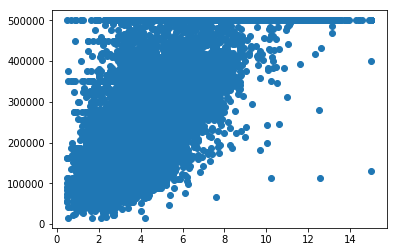
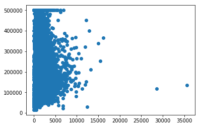
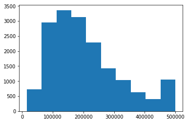
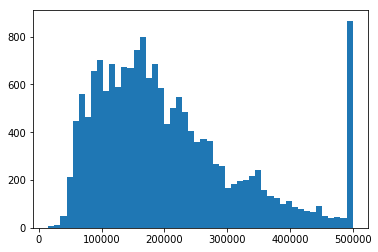
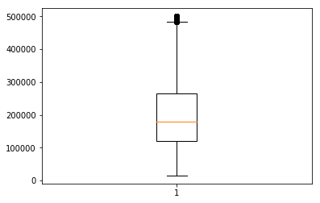
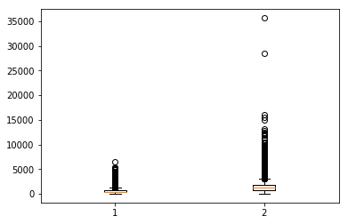
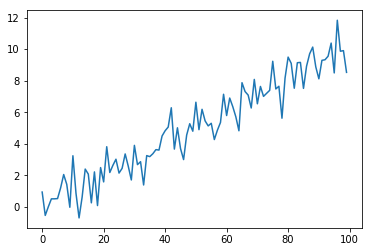
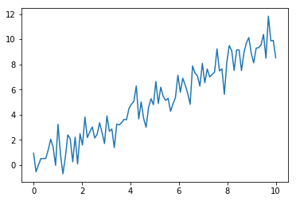
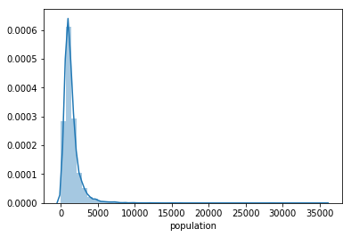
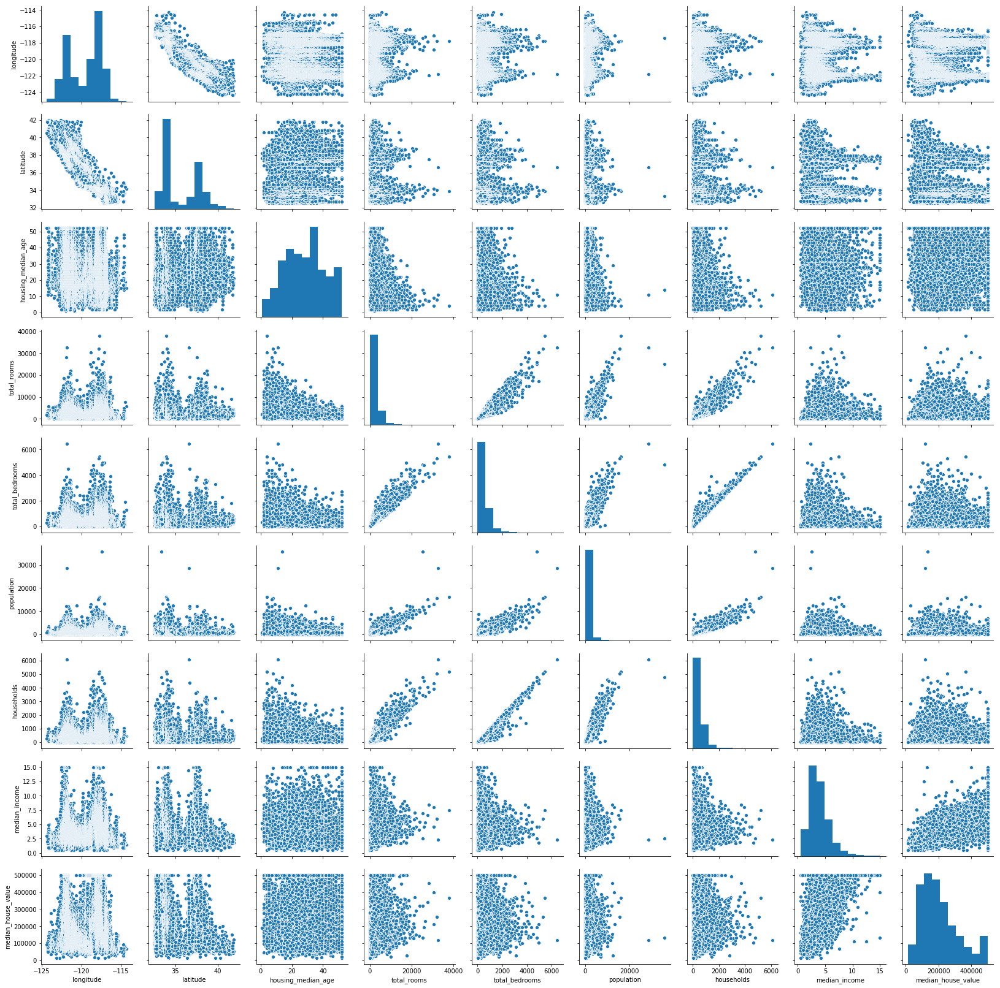

<!-- Re-authored after migration because the original notebook content was too list-like for self-study. -->

# Matplotlib 応用

## この章の目的

本章では，グラフの種類を列挙するのではなく，目的に応じて図を選び，保存可能な形で出力することを目標にします．

- 散布図，ヒストグラム，箱ひげ図，折れ線グラフの使い分けを説明できる
- `plt.figure()` や `plt.subplots()` で図の構成を制御できる
- `xlabel`, `ylabel`, `title`, `legend` を使って図を読める形にできる
- `savefig` を使って提出物や再現用の図を保存できる
- seaborn を併用して分布や相関を効率的に確認できる

## 読み込みと保存先の準備

```python
from pathlib import Path

import matplotlib.pyplot as plt
import numpy as np
import pandas as pd

output_dir = Path("outputs/ch08")
output_dir.mkdir(parents=True, exist_ok=True)
```

```python
df = pd.read_csv("sample_data/california_housing_train.csv")
print(df.shape)
print(df.columns.tolist())
```

## 散布図

### 何を見るための図か

散布図は 2 つの連続値変数の関係を見るための図です．
相関，外れ値，クラスタ，非線形性の有無を確認するのに向いています．

```python
plt.figure(figsize=(6, 4))
plt.scatter(df["median_income"], df["median_house_value"], s=8, alpha=0.4)
plt.xlabel("median_income")
plt.ylabel("median_house_value")
plt.title("Income vs house value")
plt.tight_layout()
plt.savefig(output_dir / "scatter_income_value.png", dpi=150)
plt.close()
```



```python
plt.figure(figsize=(6, 4))
plt.scatter(df["population"], df["median_house_value"], s=8, alpha=0.3)
plt.xlabel("population")
plt.ylabel("median_house_value")
plt.tight_layout()
plt.savefig(output_dir / "scatter_population_value.png", dpi=150)
plt.close()
```



## ヒストグラム

### 何を見るための図か

ヒストグラムは 1 変数の分布を見る図です．
値の集中，裾の長さ，偏り，打ち切りの有無などを確認できます．

```python
plt.figure(figsize=(6, 4))
plt.hist(df["median_house_value"], bins=30, edgecolor="black")
plt.xlabel("median_house_value")
plt.ylabel("count")
plt.title("Distribution of house values")
plt.tight_layout()
plt.savefig(output_dir / "hist_house_value.png", dpi=150)
plt.close()
```



`bins` は分布を見る粒度を決める引数です．

```python
plt.figure(figsize=(6, 4))
plt.hist(df["median_house_value"], bins=50, edgecolor="black")
plt.xlabel("median_house_value")
plt.ylabel("count")
plt.tight_layout()
plt.savefig(output_dir / "hist_house_value_bins50.png", dpi=150)
plt.close()
```



## 箱ひげ図

箱ひげ図は五数要約に基づいて分布を要約する図です．
ばらつきや外れ値をコンパクトに確認できます．

```python
plt.figure(figsize=(4, 4))
plt.boxplot(df["median_house_value"])
plt.ylabel("median_house_value")
plt.tight_layout()
plt.savefig(output_dir / "box_house_value.png", dpi=150)
plt.close()
```



```python
plt.figure(figsize=(5, 4))
plt.boxplot((df["total_bedrooms"], df["population"]),
            labels=["total_bedrooms", "population"])
plt.tight_layout()
plt.savefig(output_dir / "box_multiple.png", dpi=150)
plt.close()
```



## 折れ線グラフ

折れ線グラフは時系列や順序ある連続変化を見るのに向いています．

```python
rng = np.random.default_rng(0)
x = np.linspace(0, 10, 100)
y = x + rng.normal(scale=1.0, size=100)

plt.figure(figsize=(6, 4))
plt.plot(y)
plt.xlabel("index")
plt.ylabel("value")
plt.tight_layout()
plt.savefig(output_dir / "line_index_only.png", dpi=150)
plt.close()
```



```python
plt.figure(figsize=(6, 4))
plt.plot(x, y, label="noisy line")
plt.xlabel("x")
plt.ylabel("y")
plt.legend()
plt.tight_layout()
plt.savefig(output_dir / "line_xy.png", dpi=150)
plt.close()
```



## 図を読める形に整える

最低限そろえるべき要素は次です．

- 横軸ラベル
- 縦軸ラベル
- 必要ならタイトル
- 複数系列があるなら凡例
- 保存時の解像度と余白調整

```python
plt.figure(figsize=(6, 4))
plt.plot(x, y, color="tab:blue", linewidth=2, label="signal")
plt.xlabel("x")
plt.ylabel("y")
plt.title("Example plot")
plt.legend()
plt.grid(True, alpha=0.3)
plt.tight_layout()
plt.savefig(output_dir / "styled_plot.png", dpi=150)
plt.close()
```

## `subplots` で複数図を並べる

```python
fig, axes = plt.subplots(1, 2, figsize=(10, 4))

axes[0].hist(df["median_income"], bins=30, edgecolor="black")
axes[0].set_title("median_income")
axes[0].set_xlabel("value")
axes[0].set_ylabel("count")

axes[1].scatter(df["median_income"], df["median_house_value"], s=8, alpha=0.3)
axes[1].set_title("income vs house value")
axes[1].set_xlabel("median_income")
axes[1].set_ylabel("median_house_value")

fig.tight_layout()
fig.savefig(output_dir / "subplots_example.png", dpi=150)
plt.close(fig)
```

## seaborn の使いどころ

seaborn は Matplotlib を土台にした高水準可視化ライブラリです．

```python
import seaborn as sns
```

古い資料では `sns.distplot()` が出てきますが，現在は非推奨です．
代わりに `sns.histplot()` を使う方が安全です．

```python
plt.figure(figsize=(6, 4))
sns.histplot(df["population"], bins=30, kde=True)
plt.tight_layout()
plt.savefig(output_dir / "sns_histplot_population.png", dpi=150)
plt.close()
```



```python
cols = ["median_income", "median_house_value", "population", "households"]
grid = sns.pairplot(df[cols].sample(1000, random_state=0))
grid.savefig(output_dir / "pairplot_selected_columns.png", dpi=150)
plt.close("all")
```



## この章で押さえるべき点

- 散布図は 2 変数の関係，ヒストグラムは 1 変数の分布，箱ひげ図は分布の要約，折れ線グラフは順序ある変化を見る図である
- グラフの種類を覚えるだけでなく，何を確認したいからその図を選ぶのかを説明できることが重要である
- `xlabel`, `ylabel`, `legend`, `tight_layout`, `savefig` は基本セットである
- 複数図を扱うときは `subplots` を使うと管理しやすい
- seaborn は便利だが，Matplotlib の基本概念を理解した上で使うべきである
