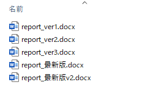

# 第1章: 基本操作

## はじめに
この資料は、木下研で研究をはじめるにあたって必要となる，信号処理や機械学習（ディープラーニングを含む）の仕組みやプログラムを理解するために書かれたものです．

基礎となる数学の知識から、Python というプログラミング言語を用いたコーディングの基本、機械学習・ディープラーニングの基礎的な理論、音や画像の信号処理の理論とコーディングに至るまで、幅広いトピックを解説しています。

研究には、ある程度、線形代数や確率統計といった数学の知識から、何らかのプログラミング言語が使えることなどが必要となってきます。
しかし、そういった数学やプログラミングの全てに精通していなければ研究をはじめられないかというと、必ずしもそうではありません。

本資料では、まず必要になる最低限の数学とプログラミングの知識から学び始められるように、資料を充実させています。
また，本資料に沿って作成する提出物はGitHub上のrepoで管理します．

GitHubは，現在のソフトウェア開発にはなくてはならないサービスです．
まずは，GitHubのことから勉強をはじめましょう．

## GitHub
GitHub は，`Git`を使った`バージョン管理`システムをインターネット上で提供するサービスです．
さて，`Git`や`バージョン管理`という聞き慣れない用語が出てきました．

以下の図を見てください．



レポートを作成する際，図のような状況になったことはありませんか？
なにか大きな修正が必要となったときに，昔の状態に戻せなくなってしまうことが不安でファイルをコピーしておき，
どれが新しいバージョンなのかわかるように名前をつけておく．
ただ，修正したものよりも，修正前のほうがやっぱり良いと思って古いバージョンのファイルに修正を加えてそれを最新版とする…．
こういったことを繰り返すと，どれが最新のファイルなのかわからなくなってしまいます．

プログラミングでも同様の事が起こります．
つまり，プログラムを修正する際にバックアップのためプログラムをコピーすることを繰り返すと，
最新のプログラムがどれかわからなくなってしまいます．
1人の状況ならまだ良いですが，複数人で開発を行うとなると状況はさらに複雑になってしまいます．

バージョン管理システムは，このような混乱を避け，ファイルのバージョンをきれいに管理するためのシステムです．
具体的には，以下のような機能を持ちます．
- ファイルの変更や更新を自動で管理してくれる
- だれが，いつ，どこを変更したかを記録してくれる
- 過去の状態にすぐに戻すことができる

こうした機能を提供するシステムの1つがGitで，GitHubはgitを使って動いているサービスです．
GitHubを使ってファイルを管理するとそれらファイルがインターネット上のサーバにもコピーされるため，
卒業論文の締め切り前にPCが壊れてファイルがなくなってしまっても，すぐにダウンロードできます．

## Git の用語
Git には専門的な用語が複数使われます．
これら用語を初心者に馴染みのある言葉で説明します．
わかりやすさ重視のために正確性を多少犠牲にしています．

### リポジトリ (repository)
リポジトリとは，バージョン管理を行っているフォルダのことを言います．
そのフォルダ (リポジトリ) の中に作られるすべてのフォルダやファイルがバージョン管理の対象となります．
リポジトリには，以下の2種類があります．
- ローカルリポジトリ

    手元のPCに保存されているリポジトリです

- リモートリポジトリ

    GitHubのサーバ上に保存されているリポジトリです

### クローン (clone)
クローンは，一言でいうと**ダウンロード**です．
リモートリポジトリ (GitHubのサーバ上にあるリポジトリ) を
ローカルリポジトリ (手元のPC) にダウンロードすることを指します．

### プル (pull)
プルも，一言でいうと**ダウンロード**です．
クローンと何が違うのかと思ったのではないでしょうか．
クローンは，リモートリポジトリのデータをすべてダウンロードするのに対し，
プルは，**ローカルリポジトリにないデータだけをダウンロード**します．

### アッド (add)
ローカルリポジトリのファイルを変更したとします．
このとき，Gitは，「今回，リポジトリ内のどのファイルがどれだけ変更されたか」を記録します．
この変更されたファイルのリストを作成するための作業をアッドと言います．

### コミット (commit)
コミットは，今回の変更をGitに保存することです．
アッドしたファイルを実際にリポジトリの変更履歴として保存します．
ライザップとは関係ありません．

コミットを行うと**その時点でのリポジトリの状態が保存**されます．
これにより，もし間違った修正などをしてしまったときには，過去にコミットした時点の状態にいつでも戻すことができます．

### プッシュ (push)
一言でいうと**アップロード**です．
コミットして変更が保存されたローカルリポジトリをリモートリポジトリにアップロードすることです．

### ブランチ (branch)
リポジトリの内容をコピーしたものを作成することです．
作成されたコピーのこともブランチと呼びます．
初期状態では，リポジトリには main ブランチと呼ばれるブランチが1つのみあります．
mainブランチから作成された新しいブランチのファイルは，元々のファイルと独立に変更することができます．

### マージ (merge)
ブランチ同士を結合して一つのブランチにまとめることです．
個々のブランチで変更された箇所を集約します．
複数人で作業を行う際などには，一人ひとりが自分用のブランチを作成し，
作業が完了したところでブランチをmainブランチにマージするといった手順が取られます．
ちょっと面倒ですが，こういった手順を踏むことで，現在のファイルに誤った修正を加えてしまうリスクを抑え
安全にファイルを更新していくことができます．


## GitHub の用語
Git をベースとして動いているGitHubですが，GitHubならではの機能もあります．

### フォーク (fork)
フォークは、他の誰かがGitHub上で作成したリモートリポジトリを、自分自身のリモートリポジトリとしてコピーするための機能です。
他の人のリポジトリで公開されているプログラムに，自分にとってより使いやすくなるよう修正したいとします．
しかし，他の人のリポジトリを勝手に編集することは，普通できません．
ここでフォークを利用すると、そのリポジトリの全てのコードを自分自身のリポジトリとしてコピーすることができます。
そして，コピーしたリポジトリに対しては，自由に変更を加えることが可能になります。

このゼミでは，B3の通常提出でforkは使いません．
forkは「他人の公開repoを自分側にコピーして改善したいときに使う機能」と理解すれば十分です．

### プルリクエスト (pull request)
フォークしたリポジトリへの変更が他の人にとっても有用だと思う場合，
元々 (フォーク元)のリポジトリに同じ変更を反映させたいと思うかもしれません．
そのような場合に利用できる機能がプルリクエストです．

これは，フォークしたリポジトリから元々のリポジトリへ変更を反映させるリクエストを送る機能で、
元々のリポジトリの管理者がその変更を承認することで変更が反映されます．

このゼミでは，pull request はGit/GitHubの学習項目として1回体験しますが，
B3の毎週の通常提出では必須にしません．


以上がGitおよびGitHubの大まかな説明ですが，やはり言葉だけでの説明では理解しにくいと思います．
実際にこれらの操作を行って，理解を深めましょう．

## 実践 GitHub

このゼミでは，教材repoと自分の作業repo（提出repo／submission repo）を分けて使う。
第1回の [自分用リポジトリの作成](../../handouts/01-environment-and-workflow.md#自分用リポジトリの作成)で，
`ykinolab-tokai` 所有の非公開 `signal-ml-work-<GitHubユーザー名>` を作成し，
作成したrepoのREADMEに従って `~/workspace/signal-ml-work` にcloneする。
教材repoは `~/workspace/signal-ml-training` に置く。
取得済みなら，もう一度cloneせず次の手順で既存の作業repoを開く。
未作成・未取得なら，先に第1回と作業repoのREADMEの手順を完了する。

### 通常作業を始める

以下のコマンドはターミナル（WindowsではWSLのUbuntu）で実行する。

```bash
cd ~/workspace/signal-ml-work
code .
git status
```

通常作業は `main` で行う。他のブランチで練習していた場合は，後述の「PR練習後に通常作業へ戻る」を先に行う。
Gitの名前・メールアドレスをまだ設定していない場合は，自分の情報を設定する。

```bash
git config --global user.name "<ユーザ名>"
git config --global user.email "<メールアドレス>"
```

この章の操作練習では，作業repo内に `exercise/git-practice.txt` を作り，例えば「Gitの操作を確認した」と書く。
VS Codeで作成してよい。ターミナルで作る場合は次を実行する。

```bash
mkdir -p exercise
vim exercise/git-practice.txt
```

Vimでは `i` で入力を始め，入力後に `Esc`，`:wq`，Enterの順で保存して終了する。
現在地は作業repoのルートのままにする。
演習コードと結果の保存規則は [共通手順](../../handouts/README.md#作業場所と保存先)に従う。
Pythonを実行するときは，教材側の環境を有効にする。

```bash
source ../signal-ml-training/.venv/bin/activate
```

作成・変更したファイルを確認して，記録・送信する。

```bash
git status
git add exercise/git-practice.txt
git commit -m "Record Git practice"
git push origin main
```

通常の演習でも，対象ファイル名をその回に作成・変更したものへ置き換えて `edit -> commit -> push` を行う。
forkや毎回のPR作成は不要である。

### pull request の練習

`main` の作業をcommit・pushし，未commitの変更がないことを `git status` で確認してから，練習ブランチを作る。

```bash
git switch -c pr-practice
```

`exercise/git-practice.txt` に「PRの差分を確認する」と追記し，保存してから次を実行する。

```bash
git add exercise/git-practice.txt
git commit -m "Record PR practice"
git push -u origin pr-practice
```

GitHub上で，**自分の作業repoの `main` を宛先（base）**，`pr-practice` を比較元（compare）にしたPRを作成する。
PR本文に「変更点」「確認方法」「未確認事項」を書く。
教材repoや作業テンプレートrepoへ送るPRではない。
練習の追記・レビューへの修正は同じ練習ブランチにcommitしてpushする。

### PR練習後に通常作業へ戻る

次回の通常作業の前に，練習ブランチの変更を保存・commit・pushしてから次を実行する。

```bash
git status
# Continue only with a clean working tree
git switch main
git pull --ff-only origin main
git status
```

最後の表示が `main` であることを確認してから，次回のファイルを編集する。
PRがマージ済みなら，同期後の `main` に練習の変更も含まれる。
レビュー待ちなら，変更は練習ブランチに残り，まだ `main` には含まれない。
ブランチは残し，修正するときは `git switch pr-practice` で戻る。
次回の作業が未マージの変更を必要とする場合は，先にレビューとマージの扱いを担当者に確認する。
切り替えや同期が失敗した場合はエラーを確認し，変更を削除して進めない。
練習ブランチでcommitした変更は，`git push origin main` では送信されないことにも注意する。
